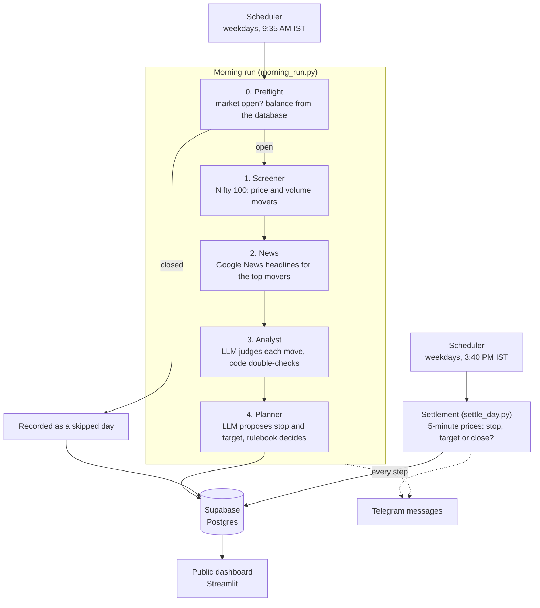

# AI Day Trader: a paper-trading experiment

An autonomous AI agent that screens Indian stocks (Nifty 100), reads the news, decides whether a move has a real
reason behind it, plans trades with a stop-loss and a target, and then finds out what would have happened. All with
**fake money**, every trading day, with no human in the loop. Everything it does is recorded in a database, announced
on Telegram, and shown on a public dashboard.

> ## ⚠️ Disclaimer
> This is a **simulation**. No real orders are placed and no real money is involved. It is a personal engineering
> and learning project, **not investment advice**, and nothing it produces is a recommendation to buy or sell anything.
> Results ignore brokerage, taxes and slippage, so real trading would have done worse. A few weeks of results prove
> nothing: luck can look like skill. Do not trade based on this project.

<!-- Add a screenshot of the dashboard here, for example:  -->

## How a trading day works



1. **Preflight.** Runs only on a trading day between 9:30 AM and 2:30 PM IST. It stops (and records a skipped day) on
   weekends, listed holidays, or when Yahoo has no Nifty candle for today. It reads the available balance from the
   database (the latest ending balance, or ₹1,00,000 on the very first run).
2. **Screener.** One batch download for the Nifty 100. A stock passes if it is up at least 0.5% from yesterday's close
   with volume at least at its normal pace (scaled for how much of the trading day has passed). The top 10 by
   *move × volume* go on.
3. **News.** For each mover it fetches up to 5 headlines from the last 3 days.
4. **Analyst.** An LLM fills in a structured verdict per stock: is there a fresh, specific, bullish catalyst, and how
   strong is it? Plain code then double-checks: the headline it cites must actually name the company, garbled answers
   are retried, and only *strong*, *bullish* catalysts reach the watchlist.
5. **Planner.** For each watchlist stock the LLM proposes a stop-loss and a target. A rulebook in code decides:
   the stop must be meaningful (at least a third of the stock's typical daily range away), the target reachable (at
   most one range away), reward/risk at least 1.5, risk at most 1% of the balance per trade, at most 30% of the
   balance in one stock, at most 3 positions a day. Prices are rounded to NSE's 0.05 steps.
6. **Settlement** (after the close). For every accepted plan it walks through the day's 5-minute candles in order:
   target touched, stop touched (the stop wins if both happen in one candle), or closed at the 3:15 PM square-off.
   It writes the results, the day's profit and loss and the new balance, and compares the day with what the Nifty
   did over the same time window.

## Design principles

- **The LLM judges, code decides.** Position sizes, risk limits and every number come from deterministic code.
  The model never touches money maths.
- **Nothing the model says is trusted blindly.** Verdicts cite numbered headlines (never URLs or dates, which are
  looked up in the data), and the citation is checked in code.
- **Fail closed.** If the balance can't be read or the market looks closed, the run stops instead of guessing.
- **Everything is recorded.** Runs (including skipped and failed ones), candidates, headlines, verdicts, plans
  (accepted, rejected and skipped, with reasons) and results all go to the database.
- **Public, but only after the close.** The dashboard reads read-only database views, and a day becomes visible only
  after 3:35 PM IST. Error messages and base tables are never exposed.

## Tech stack

Python 3.11+, [LangGraph](https://github.com/langchain-ai/langgraph) (the morning pipeline as a graph),
Pydantic, Gemini 2.5 Flash through LangChain (switchable, see below), `yfinance` (prices), Google News RSS (headlines),
Supabase (Postgres, with row-level security), Streamlit (dashboard), Telegram Bot API (notifications).
Planned deployment: Google Cloud Run Jobs + Cloud Scheduler.

## Repository layout

```
.
├── morning_run.py        the morning job (preflight, screener, news, analyst, planner)
├── settle_day.py         the end-of-day settlement job
├── scheduler.py          runs both jobs on weekdays (not needed on Cloud Run: Cloud Scheduler does this)
├── rules.py              the risk rulebook
├── settlement.py         the settlement rule and the benchmark calculation
├── storage.py            everything that reads or writes Supabase
├── messages.py           the text of every Telegram message
├── notify.py             the Telegram sender (never crashes the app)
├── llm_setup.py          which model to use, from .env
├── llm_test.py           checks that a model can fill in structured forms
├── requirements.txt
├── .env.example          every setting, with no secrets
├── sql/
│   ├── schema.sql                          the tables
│   ├── migration_001.sql                   skipped/failed runs, benchmark columns
│   ├── migration_002_public_views.sql      the read-only public views
│   └── migration_003_public_everything.sql the full public story, one official run per day
└── dashboard/            the public Streamlit dashboard (its own requirements and theme)
```

## Setup

You need Python 3.11+, a [Supabase](https://supabase.com) project, a Google AI Studio (Gemini) API key, and
optionally a Telegram bot (from `@BotFather`).

1. **Install.**
   ```bash
   python -m venv .venv
   source .venv/bin/activate          # Windows: .venv\Scripts\activate
   pip install -r requirements.txt
   ```
2. **Download the stock universe.** Get the *Nifty 100 constituents* CSV from NSE (niftyindices.com) and save it as
   `nifty100.csv` in the project root. It needs a `Symbol` column and ideally a `Company Name` column. (It is not
   committed to this repository.)
3. **Create the database.** In the Supabase SQL Editor, run these files in order:
   `sql/schema.sql`, `sql/migration_001.sql`, `sql/migration_002_public_views.sql`,
   `sql/migration_003_public_everything.sql`.
4. **Configure.** Copy `.env.example` to `.env` and fill it in (see the table below). Use the Supabase **secret** key
   for `SUPABASE_KEY`. Never commit `.env`.
5. **Check the pieces.**
   ```bash
   python notify.py        # sends a test Telegram message
   python llm_test.py      # checks the model can fill in a form
   ```

## Running

```bash
python morning_run.py     # the morning job. Outside market hours it stops at preflight, unless FORCE_RUN=1
python settle_day.py      # after 3:35 PM IST: settles the day's trades and updates the balance
python scheduler.py       # runs both on schedule (add --dry-run to see the next run times)
```

To test outside market hours, set `FORCE_RUN=1`. On a weekend or holiday the run then uses the last completed
session's data and is marked as not live, so it is never settled or shown publicly. (On Windows PowerShell:
`$env:FORCE_RUN="1"`.) See the note under *Known limitations* about forced runs on a trading day.

## Dashboard

```bash
cd dashboard
pip install -r requirements.txt
streamlit run app.py
```

Run it from inside `dashboard/` so the dark neon theme in `.streamlit/config.toml` is picked up. It reads only the
`public_*` views using the **publishable** key (`SUPABASE_PUBLISHABLE_KEY`), never the secret key. Set
`DASHBOARD_DEMO=1` to preview the layout with made-up data. It has five tabs: overview (balance vs the Nifty, daily
profit and loss, trade outcomes), day by day (what the app looked at and why it did or didn't act), all trades (with
CSV download), blog, and about.

## Configuration

| Variable | Used by | Meaning |
|---|---|---|
| `GOOGLE_API_KEY` | morning run | Gemini API key |
| `LLM_PROVIDER`, `LLM_MODEL` | morning run | Model choice. Defaults: `gemini`, `gemini-2.5-flash`. Other providers (`groq`, `mistral`, `openrouter`) work after `pip install` of the matching `langchain-*` package and setting that provider's key |
| `SUPABASE_URL` | all | Project URL |
| `SUPABASE_KEY` | morning run, settlement | **Secret** key. Server-side only |
| `SUPABASE_PUBLISHABLE_KEY` | dashboard | Public, read-only key |
| `TELEGRAM_BOT_TOKEN`, `TELEGRAM_CHAT_ID` | all jobs | Notifications. Optional |
| `TELEGRAM_ENABLED=0` | all jobs | Mute all messages |
| `NSE_HOLIDAYS` | morning run | Comma-separated dates, e.g. `2026-11-09,2026-11-24`. Holidays vary every year, so you list them |
| `MORNING_TIME`, `SETTLE_TIME` | scheduler | Default `09:35` and `15:40` (IST) |
| `FORCE_RUN`, `FORCE_SETTLE` | jobs | Testing switches. The scheduler forces them off |
| `DASHBOARD_DEMO=1` | dashboard | Show sample data |

The tunable thresholds (minimum move, volume pace, number of candidates and positions, risk limits) are constants at
the top of `morning_run.py` and `rules.py`.

## What is saved

`runs` (one row per execution, including skipped and failed ones), `candidates`, `headlines`, `verdicts`, `plans`,
`trade_results`, `daily_equity` (balance, benchmark, capital used), `blog_posts`. Every table has row-level security
on with no policies, so the public can only read the curated `public_*` views.

## Known limitations

- Free, unofficial data sources (Yahoo Finance, Google News RSS) can be delayed, throttled, wrong or blocked.
- Settlement fills stops and targets at their exact prices and ignores brokerage, taxes and slippage.
- The three daily positions are chosen by screener rank, not yet by the model, and the model doesn't yet avoid
  holding several stocks that ride the same story.
- Holidays must be listed by hand (a missing Nifty candle is the backup check).
- The *latest finished run with live data* is each day's official run. A manual `FORCE_RUN=1` run made on a trading
  day after the morning run therefore replaces it. Use forced runs on weekends and holidays, or delete the test run
  from the `runs` table.
- Results from a handful of days are statistically meaningless.

## Roadmap

- [x] Screener, news, analyst, planner pipeline on LangGraph
- [x] Supabase storage, including skipped and failed runs
- [x] End-of-day settlement with a Nifty benchmark
- [x] Telegram notifications at every step
- [x] Public dashboard
- [ ] Deployment on Cloud Run Jobs + Cloud Scheduler
- [ ] Daily AI-written blog, generated from the saved data
- [ ] Scheduled posts for social media
- [ ] Model switching through `.env` only (OpenAI-compatible endpoints)
- [ ] Brokerage, tax and slippage modelling
- [ ] Market-regime filter (skip clearly bearish days)

## License

Add a license before making this repository public (for example MIT).
