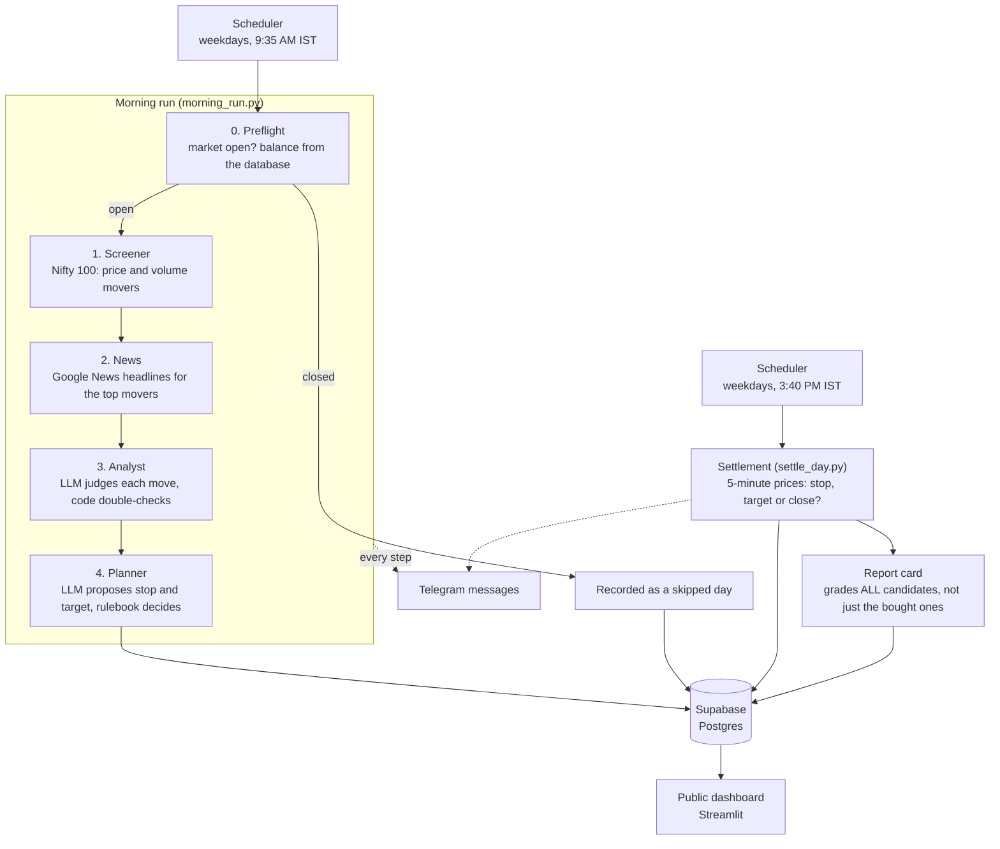

# AI Day Trader: a paper-trading experiment

An autonomous AI agent that screens Indian stocks (Nifty 100), reads the news, decides whether a move has a real
reason behind it, plans trades with a stop-loss and a target, and then finds out what would have happened. All with
**fake money**, every trading day, with no human in the loop. Everything it does is recorded in a database, announced
on Telegram, and shown on a public dashboard.

> ## ⚠️ Disclaimer
> This is a **simulation**. No real orders are placed and no real money is involved. It is a personal engineering
> and learning project, **not investment advice**, and nothing it produces is a recommendation to buy or sell anything.
> Results ignore brokerage, taxes and slippage, so real trading would have done worse. A few weeks of results prove
> nothing: luck can look like skill. Do not trade based on this project.

<!-- Add a screenshot of the dashboard here, for example:  -->

## Contents

1. [The idea in one minute](#the-idea-in-one-minute)
2. [A trading day, step by step (with a worked example)](#a-trading-day-step-by-step-with-a-worked-example)
3. [Design principles](#design-principles)
4. [Repository layout](#repository-layout)
5. [Setup](#setup) · [Running](#running) · [Tests](#tests) · [Dashboard](#dashboard)
6. [Configuration](#configuration)
7. [What is saved](#what-is-saved)
8. [Deployment (GCP VM)](#deployment-gcp-vm)
9. [Things that will bite you](#things-that-will-bite-you)
10. [Findings so far and known limitations](#findings-so-far-and-known-limitations)
11. [Roadmap](#roadmap)
12. [Notes for contributors and AI assistants](#notes-for-contributors-and-ai-assistants)

## The idea in one minute

Think of it as a very small trading desk made of four employees, each with one job:

| Employee | Job | AI or plain code? |
|---|---|---|
| **Screener** | Looks at the 100 biggest stocks and finds the ones moving today on unusual volume | Plain code |
| **Analyst** | Reads each mover's headlines and answers: *is there a real, fresh reason for this move?* | LLM, double-checked by code |
| **Planner** | Proposes a stop-loss and a target for each stock the analyst liked | LLM proposes, **a rulebook in code decides** |
| **Settler** | After the close, replays the day's 5-minute prices and records what each trade would have done | Plain code |

The LLM is never trusted with money. It reads text and suggests numbers; code checks every number against fixed rules.
Each evening a **report card** also grades the stocks the app *didn't* buy, so we can later tell whether the analyst's
favourites really did better than the rest.

## A trading day, step by step (with a worked example)



The example below follows one **made-up** stock ("EXAMPLE Ltd.") through the whole day. The rulebook numbers in step 4
and the settlement results in step 5 were produced by running the repository's real code (`rules.py`, `settlement.py`).

### Step 0. Preflight (`morning_run.py: preflight`)
Runs only on a trading day between **9:30 and 14:30 IST**. Before 9:30 prices are too noisy; after 14:30 too little of
the day is left to reach a target. It stops, and records a *skipped* day, on weekends, on holidays you listed in
`NSE_HOLIDAYS`, or when Yahoo has no Nifty candle for today (the backup holiday check). It then reads the available
balance from the database: the latest `ending_balance`, or ₹1,00,000 on the very first run. If the balance can't be
read, it stops rather than guess ("fail closed").

### Step 1. Screener (plain code, no AI)
One batch download of the Nifty 100 from Yahoo Finance. A stock passes if it is **up at least 0.5%** from yesterday's
close **and** trades at least **1.0x its normal volume pace**. "Pace" matters: at 10:00 only a quarter of the day has
passed, so the code scales the expected volume by `session_fraction()` instead of comparing with a full day. The top
**10** by *move × volume* go on to the news step. (Early in the morning the volume multiple looks inflated, for example
"x25", because trading is front-loaded. The ranking is still valid.)

> *Example:* EXAMPLE Ltd. is up 2.8% at 9:35 on 3.8x volume, price ₹331.00, typical daily range ₹6.40
> (the average of the last days' high minus low). It ranks in the top 10.

### Step 2. News (plain code)
For each mover, up to **5 headlines from the last 3 days** from Google News RSS (`"Company name" when:3d`). Each
headline is dated, and the rupee sign is replaced by "Rs" because it once confused a model.

### Step 3. Analyst (LLM judges, code double-checks)
For each stock the LLM sees the numbered headlines and must fill in a structured form (`Verdict`):

| Field | Meaning |
|---|---|
| `has_catalyst` | a fresh, specific reason to move exists |
| `bullish` | the news points up |
| `strength` | `strong` only for: company results, an order win, a regulatory approval, a deal, or an upgrade/target from a named brokerage. Everything else is `weak` |
| `catalyst_type` | `earnings`, `broker_call`, `block_deal`, `sector_news` or `other` |
| `reason`, `source_numbers` | one or two sentences, and the numbers of the headlines it relied on |

Then plain code checks the model's work:
1. **The citation must name the company.** If no cited headline contains the company name (or symbol), `has_catalyst`
   is overruled to `False`.
2. **Garbled answers are retried** (text leaking into the reason, over 400 characters) and rejected after two tries.
3. **Only `strong` + `bullish` + real catalyst** reaches the *watchlist*.

> *Example headlines:* `[1] (08 Oct) EXAMPLE Q2 profit up 28%, JPMorgan raises target to Rs 1,150` →
> `has_catalyst=True, bullish=True, strength=strong, catalyst_type=broker_call, source_numbers=[1]` → on the watchlist.
> A headline like `[2] (08 Oct) EXAMPLE set to announce first interim dividend` describes something that has *not
> happened yet*; it should be `weak`. (This is a known weak spot, see Findings.)

### Step 4. Planner (LLM proposes, the rulebook decides)
For each watchlist stock, in screener-rank order, the LLM is asked for a **stop-loss** and a **target**. The prompt asks
for a stop at least 40% of the typical daily range below the buy price (`STOP_ASK_FRACTION`), a target no more than about
one range above, and a target at least 1.7x as far above as the stop is below. Then code takes over (`rules.py`):

| Rule | Value |
|---|---|
| Stop must be at least | 0.33 x the typical daily range below the buy price (otherwise normal wobble hits it) |
| Target must be at most | 1.0 x the typical daily range above the buy price (otherwise unreachable) |
| Reward / risk at least | 1.5 |
| Risk per trade at most | 1% of the balance |
| Money in one stock at most | 30% of the balance |
| Positions per day at most | 3 (extra watchlist stocks are recorded as *skipped*) |
| Prices | rounded to NSE's 0.05 steps |

**The nudge.** Language models tend to land *just outside* a stated limit (we saw a stop 5 paise too close, and
targets 6% to 29% too far). So `nudge_plan()` moves a stop or target that is within 50% of a limit to *exactly* the limit,
rounded safely, instead of rejecting the whole plan. Plans further out are still rejected, and the nudged plan still
goes through every other rule. Every nudge is logged, and Telegram marks the plan with `✎ adjusted by the rulebook`.

> *Worked example* (balance ₹1,00,000, EXAMPLE at ₹331.00, range ₹6.40):
> - Minimum stop distance = 0.33 x 6.40 = **2.11**. Maximum target distance = **6.40**.
> - The model proposes stop **329.00** (2.00 below) and target **338.00** (7.00 above).
> - Without the nudge: rejected, `stop is only 2.00 away; normal wobble (6.40 a day) would hit it`.
> - Nudge: stop moved to **328.85** (2.15 below), target moved to **337.40** (exactly 6.40 above).
> - Sizing: risk per share 2.15, so the 1% risk budget (₹1,000) allows 465 shares; the 30% cash cap (₹30,000 / 331)
>   allows **90** shares. The smaller wins: **90 shares**, cost ₹29,790, worst case −₹193.50, best case +₹576.00,
>   reward/risk 2.98.
>
> (In practice the 30% cash cap usually decides the share count, not the risk limit.)

### Step 5. Settlement (`settle_day.py`, after 3:35 PM)
For every accepted plan the job walks through the day's **5-minute candles** in order, starting with the first full
candle after the run began, and stops at the first of these:
1. the candle's **low touches the stop** → `stop_hit` (checked first: if stop and target are both inside one candle, the
   **stop wins**, the pessimistic assumption),
2. the candle's **high touches the target** → `target_hit`,
3. the **3:15 PM square-off** arrives → `closed_at_end` at the last close.

> *Same example, three made-up days:* a candle at 10:25 with a low of 328.80 → `stop_hit` at 328.85, **−₹193.50**.
> A candle at 11:05 with a high of 338.20 → `target_hit` at 337.40, **+₹576.00**. A quiet day closing at 332.20 →
> `closed_at_end`, **+₹108.00**.

It then writes the trade results, the day's profit and loss, the new balance, and compares the day with what the
**Nifty** did over the same window (`benchmark_pct`). Next morning's balance comes from this table.
Simplifications: fills happen at exactly the stop or target price, and brokerage, taxes and slippage are ignored.

### Step 6. Report card (`settlement.py: candidate_outcome`, run at the end of settlement)
Settlement tells us how the 3 stocks we **bought** did. The report card does the same for **all ~10 candidates**, bought
or not, using one fixed "what if" trade so they can be compared fairly: stop = 40% of the daily range below the buy
price, target = one range above. Per stock it saves the return to the close, the highest and lowest point reached, and
how the what-if trade ended. It is wrapped so a failure here can never block the balance update.

> *Example row* for EXAMPLE (entry 331.00, range 6.40; stop 328.40, target 337.40; made-up candles):
> `std_outcome = target_hit`, `std_return_pct = +1.93`, `return_pct (hold to the close) = +1.21`,
> `max_up_pct = +2.11`, `max_down_pct = −0.24`.

Why it matters: it lets us ask "were the analyst's *strong* picks better than the *weak* ones and the skipped ones?"
Run `sql/analysis_group_comparison.sql` for the group averages. It is only meaningful after weeks of data. Past days
can be graded afterwards with `python backfill_report_cards.py` (Yahoo keeps about 60 days of 5-minute data).

### Telegram
Every step sends a message: run started (with the model name and balance), screener, news, analyst, trade plans,
run complete, and in the evening the settlement summary with one report-card line. Messages are plain HTTPS calls
(no Telegram library), long messages are split, tokens are never logged, and `TELEGRAM_ENABLED=0` mutes everything.
Keep the chat **private**: it shows specific stocks and prices.

## Design principles

- **The LLM judges, code decides.** Position sizes, risk limits and every number come from deterministic code.
  The model never touches money maths.
- **Nothing the model says is trusted blindly.** Verdicts cite numbered headlines (never URLs or dates, which are
  looked up in the data), and the citation is checked in code.
- **Fail closed.** If the balance can't be read or the market looks closed, the run stops instead of guessing.
- **Everything is recorded.** Runs (including skipped and failed ones), candidates, headlines, verdicts, plans
  (accepted, rejected and skipped, with reasons) and results all go to the database.
- **Public, but only after the close.** The dashboard reads read-only database views, and a day becomes visible only
  after 3:35 PM IST. Error messages and base tables are never exposed.
- **Measure before improving.** Changes to the news input, the prompts or the model are judged with the report cards,
  not by feel.

## Repository layout

```
.
├── morning_run.py             the morning job: preflight, screener, news, analyst, planner (a LangGraph graph)
├── settle_day.py              the end-of-day job: settlement + report card
├── scheduler.py               runs both jobs on weekdays (the VM runs this as a systemd service)
├── rules.py                   the risk rulebook, size_trade() and nudge_plan()
├── settlement.py              settle(), the benchmark calculation, candidate_outcome(), group_summary()
├── storage.py                 everything that reads or writes Supabase
├── messages.py                the text of every Telegram message
├── notify.py                  the Telegram sender (never crashes the app)
├── llm_setup.py               which model to use, from .env (gemini, openai, groq, mistral, openrouter)
├── llm_test.py                checks that a model can fill in structured forms
├── backfill_report_cards.py   grades past days that have no report card yet
├── nifty100.csv               the Nifty 100 constituents (needs Symbol and Company Name columns)
├── requirements.txt
├── .env.example               every setting, with no secrets
├── sql/
│   ├── schema.sql                            the tables
│   ├── migration_001.sql                     skipped/failed runs, benchmark and capital columns
│   ├── migration_002_public_views.sql        the read-only public views
│   ├── migration_003_public_everything.sql   the full public story, one official run per day
│   ├── migration_004_candidate_outcomes.sql  the report-card table
│   ├── migration_005_candidate_report.sql    a private view joining everything about each candidate
│   └── analysis_group_comparison.sql         strong vs weak vs skipped, grouped
├── test_*.py                  offline tests (no network, no database): see Tests
└── dashboard/                 the public Streamlit dashboard (own theme and metrics)
```

## Setup

You need Python 3.11+ (the VM runs 3.13), a [Supabase](https://supabase.com) project, an LLM API key (Google AI Studio
for Gemini, or OpenAI), and optionally a Telegram bot (from `@BotFather`).

1. **Install.**
   ```bash
   python -m venv .venv
   source .venv/bin/activate          # Windows: .venv\Scripts\activate
   pip install -r requirements.txt
   ```
2. **The stock universe.** `nifty100.csv` is in the repository. To refresh it, download the *Nifty 100 constituents*
   CSV from NSE (niftyindices.com); it needs a `Symbol` column and ideally `Company Name`.
3. **Create the database.** In the Supabase SQL Editor run, in order: `sql/schema.sql`, `sql/migration_001.sql`,
   `sql/migration_002_public_views.sql`, `sql/migration_003_public_everything.sql`,
   `sql/migration_004_candidate_outcomes.sql`, `sql/migration_005_candidate_report.sql`.
4. **Configure.** Copy `.env.example` to `.env` and fill it in (table below). Use the Supabase **secret** key for
   `SUPABASE_KEY`. Never commit `.env`.
5. **Check the pieces.**
   ```bash
   python notify.py        # sends a test Telegram message
   python llm_test.py      # checks the model can fill in a form
   ```

## Running

```bash
python morning_run.py            # the morning job. Outside market hours it stops at preflight, unless FORCE_RUN=1
python settle_day.py             # after 3:35 PM IST: settles the trades, updates the balance, makes the report card
python settle_day.py 2026-10-05  # settle a specific past day
python scheduler.py              # runs both on schedule (add --dry-run to see the next run times)
python backfill_report_cards.py  # grade past days that have no report card (--force redoes them all)
```

To test outside market hours set `FORCE_RUN=1` (PowerShell: `$env:FORCE_RUN="1"`). On a weekend or holiday the run
uses the last completed session's data and is marked *not live*, so it is never settled or shown publicly.
**Do not force a run on a trading day against your real database** (see *Things that will bite you*).

**Use a separate test database.** Create a second free Supabase project, run the same SQL files, and point your
laptop's `.env` at it (with `TELEGRAM_ENABLED=0`). The production server keeps the real project. Then experiments
and forced runs can never disturb real data.

## Tests

All tests are offline (stand-in databases and prices) and print `ALL CHECKS PASSED` or the failing check:

```bash
python test_nudge.py              # the rulebook's nudge: real plans + 200,000 random plans, zero rule violations
python test_candidate_outcome.py  # the report-card calculation on hand-made days
python test_report_card.py        # whole settlement + report card, including a report-card failure that must not block the balance
python test_backfill.py           # the backfill: official run per day, skips, re-runs without duplicates
```

## Dashboard

```bash
cd dashboard
pip install -r requirements.txt
streamlit run app.py
```

Run it from inside `dashboard/`. It reads only the `public_*` views using the **publishable** key
(`SUPABASE_PUBLISHABLE_KEY`), never the secret key. Set `DASHBOARD_DEMO=1` to preview the layout with made-up data.
Five tabs: overview (balance vs the Nifty, daily profit and loss, trade outcomes), day by day (what the app looked at
and why it did or didn't act), all trades (with CSV download), blog, and about. Streamlit reads its theme from
`.streamlit/config.toml` inside the folder you run it from.

## Configuration

| Variable | Used by | Meaning |
|---|---|---|
| `LLM_PROVIDER`, `LLM_MODEL` | morning run | Model choice. Code defaults: `gemini`, `gemini-2.5-flash`. The production VM sets `openai` / `gpt-4.1-mini`. Other providers: `groq`, `mistral`, `openrouter` (install the matching `langchain-*` package) |
| `GOOGLE_API_KEY`, `OPENAI_API_KEY`, ... | morning run | The key for the chosen provider |
| `LLM_TEMPERATURE` | morning run | Optional override. Reasoning models (gpt-5, o-series) refuse a temperature, so it is left out for them automatically. Set it empty to always leave it out |
| `SUPABASE_URL` | all | Project URL |
| `SUPABASE_KEY` | morning run, settlement | **Secret** key. Server-side only |
| `SUPABASE_PUBLISHABLE_KEY` | dashboard | Public, read-only key |
| `TELEGRAM_BOT_TOKEN`, `TELEGRAM_CHAT_ID` | all jobs | Notifications. Optional |
| `TELEGRAM_ENABLED=0` | all jobs | Mute all messages |
| `NSE_HOLIDAYS` | morning run | Comma-separated `YYYY-MM-DD` dates, e.g. `2026-10-20,2026-11-10`. Holidays vary every year, so you list them. A badly written date such as `2026-12-5` silently never matches |
| `MORNING_TIME`, `SETTLE_TIME` | scheduler | Default `09:35` and `15:40` (IST) |
| `FORCE_RUN`, `FORCE_SETTLE` | jobs | Testing switches. The scheduler forces them off |
| `DASHBOARD_DEMO=1` | dashboard | Show sample data |

The tunable thresholds are constants at the top of `morning_run.py` (`MIN_CHANGE`, `MIN_REL_VOLUME`, `MAX_CANDIDATES`,
`MAX_POSITIONS`, `STOP_ASK_FRACTION`, `RUN_FROM`, `RUN_UNTIL`) and `rules.py` (`RISK_PER_TRADE`,
`MAX_POSITION_FRACTION`, `MIN_REWARD_RISK`, `MIN_STOP_RANGE_FRACTION`, `MAX_TARGET_RANGE_FRACTION`, `NUDGE_TOLERANCE`).

## What is saved

| Table | One row per | Holds |
|---|---|---|
| `runs` | execution (including skipped and failed) | date, status (`running`, `finished`, `failed`, `skipped`), whether data was live, the model used, settings |
| `candidates` | stock the screener passed | rank, price, % change, relative volume, typical daily range |
| `headlines` | headline fetched | title, source, date, link |
| `verdicts` | stock the analyst judged | the form above, `on_watchlist`, and whether code overruled it |
| `plans` | stock the planner considered | status `accepted`, `rejected` or `skipped`, entry, stop, target, shares, reason (including any `[adjusted by the rulebook ...]` note) |
| `trade_results` | accepted plan, after settlement | outcome, exit price and time, profit or loss |
| `daily_equity` | settled day | starting and ending balance, Nifty benchmark, money used |
| `candidate_outcomes` | candidate, after the close | the report card (see Step 6) |
| `blog_posts` | post | reserved for the daily AI blog |

Every table has row-level security on with no policies, so the public can only read the curated `public_*` views.
Each day's **official run** is the latest *finished* run with *live* data; the views and queries use only that one.
`candidate_report` (private view) joins candidates, verdicts, plans, results and outcomes into one row per stock.

## Deployment (GCP VM)

The production setup is one small GCP Compute Engine VM (e2-small, 2 GB, Debian 13, a 1 GB swap file, timezone
`Asia/Kolkata`) running `scheduler.py` as a **systemd service**, so it survives crashes and reboots. A minimal unit:

```ini
[Unit]
Description=Day trader scheduler
After=network-online.target

[Service]
User=<your-user>
WorkingDirectory=/home/<your-user>/day-trader
ExecStart=/home/<your-user>/day-trader/.venv/bin/python scheduler.py
Restart=always
RestartSec=30

[Install]
WantedBy=multi-user.target
```

```bash
sudo systemctl restart day-trader                     # after .env changes
git pull                                              # after code changes (no restart needed)
journalctl -u day-trader -f                           # live log
journalctl -u day-trader --since today --no-pager | tail -30
```

**Restart rule:** the scheduler reads `.env` once, when it starts, and the jobs it launches inherit those values. So a
`.env` change needs `sudo systemctl restart day-trader`, but a code change does not, because each job is started fresh.

**Rollout order for database changes:** run new SQL on the test project first, then on the real project, *then* push
the code that uses it. Otherwise the VM may write to a table that doesn't exist yet.

## Things that will bite you

| Gotcha | What to do |
|---|---|
| `.env` edited but nothing changed | Restart the scheduler (see above) |
| A forced run on a trading day replaces that day's official run | Use forced runs on weekends or holidays, or against a test database, or delete the test run from `runs` |
| A holiday missing from `NSE_HOLIDAYS` | The backup check (no Nifty candle for today) records a skipped day, but add holidays for a cleaner message |
| LLM provider out of credit or rate-limited | The run fails and is recorded as failed; Telegram says so. Check `llm_test.py` first. A backup model is on the roadmap |
| Yahoo Finance or Google News throttle or change | These are free, unofficial sources; expect occasional gaps |
| Volume multiple looks huge at 9:35 (e.g. "x25") | Expected: early trading is front-loaded. The ranking is still valid |
| A secret in a chat, a commit or a screenshot | Rotate the key. Never paste `.env` anywhere |

## Findings so far and known limitations

Early observations (a handful of days, so **treat as hints, not conclusions**):

- **The analyst is lenient and not fully consistent.** With one model, 9 of 10 movers were rated *strong* on a busy
  day; with another, 2 of 9 on a quiet day. It sometimes rates something outside its own "strong" list as strong
  (for example a management change, or a dividend that is only *expected*). Headline titles alone are thin evidence.
- **The planner hugs the edges of the allowed box** (stops near the minimum distance, targets near the maximum).
  The nudge fixes the near-misses, but it also means most plans have the target at the maximum.
- **Sector moves look like separate stories.** On one morning 5 of the 10 movers were IT stocks and two of the three
  positions were IT, so one sector reversal could hit both stops at once.
- Settlement fills stops and targets at their exact prices and ignores brokerage, taxes and slippage. Intraday charges
  on a typical day (3 trades of about ₹30,000) are roughly ₹95, which is a large share of a small daily profit.
- The three daily positions are chosen by screener rank, not by the model.
- Holidays must be listed by hand.
- Results from a handful of days are statistically meaningless.

Tidy-ups still open: the planner's reason text is cut at 200 characters; the end-of-run summary does not show the
"adjusted by the rulebook" marker; `schema.sql` exists twice (root and `sql/`); the dashboard's `config.toml` must sit
in `dashboard/.streamlit/` for Streamlit to pick it up; no `LICENSE` file yet.

## Roadmap

- [x] Screener, news, analyst, planner pipeline on LangGraph
- [x] Supabase storage, including skipped and failed runs
- [x] End-of-day settlement with a Nifty benchmark
- [x] Telegram notifications at every step
- [x] Public dashboard
- [x] Deployment on a GCP VM (systemd service)
- [x] Model switching through `.env` (Gemini, OpenAI, Groq, Mistral, OpenRouter)
- [x] The rulebook nudge for borderline stops and targets
- [x] Report card for every candidate, with a backfill and comparison queries
- [ ] **Richer news input.** A first experiment found readable article text behind about 90% of Google News links (all
      10 sample stocks covered); next: relevance, freshness and source-quality checks, and a run from the VM
- [ ] **A "checklist" analyst.** The model answers plain factual questions (what happened, event type, already happened
      or only expected, is there a number, who is the source, before the open?) and code decides *strong*. Also sector
      context and avoiding two stocks from the same story
- [ ] Backup model if the main one fails
- [ ] "Did it run today?" alert (a check on the VM, later an outside heartbeat)
- [ ] An "after costs" figure next to the gross result
- [ ] Daily AI-written blog from the saved data
- [ ] Scheduled posts for social media (check the platform's rules first)
- [ ] Dashboard on Cloud Run
- [ ] Market-regime filter (skip clearly bearish days)

## Notes for contributors and AI assistants

How this project is built, so a new collaborator (human or AI) can continue smoothly:

- **The owner** is an experienced Java/Spring Boot architect, **new to Python and to the stock market**. Explain stock
  concepts in plain words, with software analogies where they help.
- **Work in small steps.** Explain the idea first (a tiny example helps), then give one small piece of code, then let
  the owner run it. Avoid dumping whole files. Keep a visible to-do list.
- **Test offline before handing over code.** The existing tests use stand-in databases and prices; follow that pattern
  and include a test with every behaviour change. Never claim something was tested if it wasn't (for example against a
  real website or API you can't reach).
- **Never touch real money logic with an LLM,** and never trust model output without a code check.
- **Deploy flow:** change code on the laptop, run the offline tests, run a forced test on the *test* database, commit,
  push, `git pull` on the VM. SQL changes go to the test project first, then the real one, then the code.
- **Keep outputs short.** The owner pastes only summaries of long program output, to save tokens.
- **Secrets:** never ask for, print or commit keys. `.env` is git-ignored; `.env.example` lists the variables.
- **Public repository:** no keys, chat IDs or server addresses in commits, and the Telegram group stays private.

## License

No license file has been added yet. Choose one (for example MIT) before inviting contributions.
